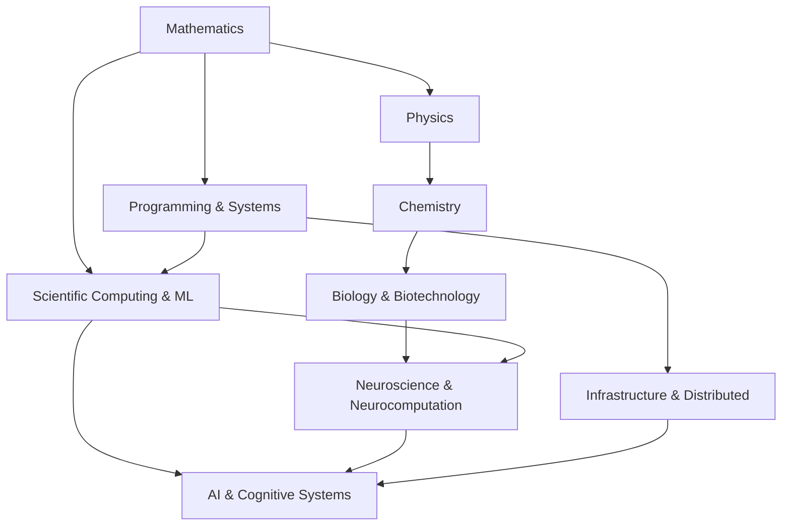
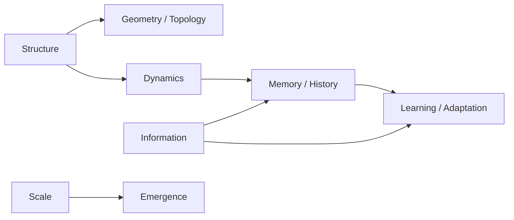

# CODEX REVIEW — estabilização arquitetural do `Courses`

Snapshot revisado: `12b1eea631d1c94474e3440e3828f5d2982f9fbd`

## Objetivo

A arquitetura atual já está conceitualmente boa:

```text
Masterclasses → conteúdo
Tracks        → domínios
Maps          → relações transversais
Roadmap       → direção de longo prazo
```

Esta revisão **não deve fazer outra grande migração**. O objetivo é estabilizar a arquitetura antes que mais conteúdo seja adicionado.

---

# 1. Inspecionar antes de alterar

```bash
git status --short
git rev-parse HEAD
find . -maxdepth 4 -type f | sort
```

O commit-base esperado é:

```text
12b1eea631d1c94474e3440e3828f5d2982f9fbd
```

Se houver mudanças locais posteriores, preservar e adaptar.

---

# 2. IDs são identificadores estáveis, não uma agenda

## Problema atual

Vários READMEs chamam as tabelas de `Sequência`.

Isso cria pressão futura para inserir novas matérias no meio e renumerar IDs.

## Mudança

Nos READMEs dos tracks, substituir headings como:

```md
## Sequência
```

por:

```md
## Currículo
```

ou:

```md
## Masterclasses
```

Adicionar em `classes/README.md` e/ou `ARCHITECTURE.md`:

```md
> Os IDs são identificadores estáveis dentro de cada track. Eles ajudam a navegação e as dependências, mas não representam uma ordem temporal obrigatória de estudo.
```

Assim, uma matéria futura pode ser adicionada como `B13`, mesmo que seja pré-requisito conceitual de `B07`, sem quebrar links ou renumerar o repositório.

---

# 3. Corrigir a semântica de status

## Problema

A versão atual mistura:

```text
✅ consolidado
✅ material estruturado
🧭 conhecimento parcial
⬜ não estruturado
```

Isso pode sugerir que uma masterclass pronta certifica domínio completo da área.

## Legenda única

Padronizar em todo o repo:

```text
📘 estruturado       → existe material principal utilizável no repositório
🟡 em estruturação  → existe material, mas ainda está sendo ampliado/revisado
🧭 a externalizar   → há familiaridade/estudo prévio, mas o conhecimento ainda não foi organizado como masterclass
⬜ planejado         → conteúdo futuro ainda não estruturado
```

Adicionar a observação:

```md
> O status mede o estado de externalização do conhecimento no repositório, não certifica domínio completo da matéria.
```

### Track A

Converter:

```text
A01 📘
A02 📘
A03 🟡
A04 🟡
A05 📘
A06 📘
```

### Tracks futuros

Não alterar indiscriminadamente tudo para `🧭`.

Preservar `🧭` onde ele significa conhecimento prévio real a organizar e `⬜` onde for apenas roadmap.

No mínimo, refletir explicitamente no roadmap atual:

```text
B06 Topologia                         🧭
B09 Sistemas Dinâmicos                🧭
D01 Neurociência Computacional        🧭
D03 Código Neural / populações        🧭
D05 Redes de Atratores                🧭
D06 Sistemas Dinâmicos Neurais        🧭
D07 Neural Manifolds                  🧭
D10 Memória / Engramas                🧭
```

Não criar pastas para esses cursos ainda.

---

# 4. Separar roadmap de longo prazo da frente ativa

Criar:

```text
roadmap/NOW.md
```

Conteúdo inicial:

```md
# NOW — Fronteira atual

[← Roadmap](README.md) · [↑ Courses](../README.md)

O roadmap completo pode ser enorme. Este arquivo contém apenas a frente ativa.

## Em estudo / estruturação

- A03 — C
- A04 — Algoritmos e Estruturas de Dados
- A05 — Assembly x86-64
- A06 — Arquitetura de Computadores

## Próxima conexão principal

- A07 — Memória e Representação de Dados

## Regra

Uma área entra neste arquivo apenas quando estiver recebendo estudo, prática ou produção ativa.
Estar no roadmap não significa estar no foco atual.
```

Adicionar links para `NOW.md` em:

```text
README.md
roadmap/README.md
```

O `roadmap/README.md` deve continuar sendo visão de anos; `NOW.md` é mutável.

---

# 5. Materializar o mapa central do projeto

Criar:

```text
maps/scales-structures-invariants.md
```

Conteúdo conceitual mínimo:

```md
# Escalas, Estruturas e Invariantes

[← Maps](README.md)

> Padrões estruturalmente semelhantes podem reaparecer em escalas e substratos diferentes sem serem literalmente o mesmo fenômeno.

## Esqueleto

```text
estado
↓
relações / restrições
↓
transformação
↓
trajetória
↓
invariantes
↓
descrição efetiva em outra escala
```

## Computação

```text
estado da máquina
↓
instruções
↓
transições
↓
invariantes arquiteturais / protocolos
↓
abstrações de software
```

## Sistemas dinâmicos

```text
estado
↓
regra de evolução
↓
trajetória
↓
estabilidade / atratores / invariantes
```

## Física

```text
estado físico
↓
dinâmica
↓
simetrias / leis de conservação
↓
descrições efetivas
```

## Química

```text
estado químico
↓
reações
↓
cinética
↓
equilíbrio / estados estáveis
```

## Biologia

```text
estado celular / organismo
↓
regulação + ambiente
↓
dinâmica
↓
homeostase / adaptação
```

## Neurociência

```text
atividade populacional
↓
dinâmica neural
↓
trajetórias no espaço de estados
↓
atratores / manifolds / representações
```

## Sistemas distribuídos

```text
estado distribuído
↓
mensagens
↓
transições concorrentes
↓
invariantes de consistência
```

## Sistemas de IA

```text
contexto / estado
↓
inferência + memória + ferramentas
↓
trajetória de processamento
↓
objetivos / restrições / invariantes operacionais
```

## Cuidado epistemológico

```text
analogia estrutural ≠ identidade causal
padrão semelhante ≠ mesma implementação
invariante matemático ≠ metáfora
correlação entre escalas ≠ mecanismo demonstrado
```
```

Esse arquivo deve ser linkado no `maps/README.md` e no README raiz.

---

# 6. Criar `maps/knowledge-graph.md`

O GitHub renderiza Mermaid em Markdown. Usar isso apenas como visualização suplementar.

Conteúdo inicial:

```md
# Knowledge Graph

[← Maps](README.md)




```

Adicionar uma observação de que o grafo representa relações úteis, não redução completa de uma disciplina à outra.

---

# 7. Transformar `maps/README.md` em índice

Manter as explicações sintéticas atuais, mas iniciar com tabela:

```md
| Map | Estado | Pergunta central |
|---|:---:|---|
| [Escalas, Estruturas e Invariantes](scales-structures-invariants.md) | 📘 | O que permanece e o que muda entre escalas? |
| [Knowledge Graph](knowledge-graph.md) | 📘 | Como os tracks se conectam? |
| Informação | 🧭 | Como codificação, transmissão e representação reaparecem? |
| Dinâmica | 🧭 | Como estados evoluem? |
| Memória e História | 🧭 | Como o passado restringe futuros possíveis? |
| Emergência | 🧭 | Quando uma descrição coletiva se torna útil? |
| Incerteza e Inferência | 🧭 | Como atualizar modelos com informação incompleta? |
| Aprendizado e Adaptação | 🧭 | Como feedback altera o sistema? |
```

Não criar os outros mapas como arquivos ainda.

---

# 8. Preparar o Track B para aprofundamento futuro

## Problema

O Track B atual salta de cálculo/EDOs para topologia e topologia algébrica sem reservar explicitamente espaço para fundamentos que provavelmente serão necessários em aprofundamentos rigorosos.

Como os IDs são estáveis, adicionar ao roadmap agora, **sem criar pastas**:

```text
B13 — Análise Real
B14 — Álgebra Abstrata
B15 — Teoria da Medida e Análise Funcional
B16 — Sistemas Complexos e Ciência de Redes
```

Status inicial:

```text
B13 ⬜
B14 ⬜
B15 ⬜
B16 🧭 ou ⬜ conforme avaliação do owner
```

Adicionar dependências conceituais:

```text
B13 Análise Real ─────────────► B03/B05/B08 em maior rigor
B14 Álgebra Abstrata ─────────► B07 Topologia Algébrica
B15 Medida / Funcional ───────► probabilidade avançada, física, EDPs e análise de espaços de funções
B09 Sistemas Dinâmicos ───────┐
B10 Teoria da Informação ─────┼──► B16 Sistemas Complexos / Redes
B04 Probabilidade ────────────┘
```

### Importante

Não renumerar B01–B12.

Os IDs não são uma cronologia obrigatória.

---

# 9. Reduzir duplicação entre H09 e I04

Atualmente:

```text
H09 — Bioquímica
I04 — Bioquímica para Sistemas Vivos
```

Os nomes são próximos demais.

Manter:

```text
H09 — Bioquímica
```

como química de biomoléculas, estrutura, termodinâmica e mecanismos.

Renomear:

```text
I04 — Metabolismo e Bioenergética Celular
```

Isso cria uma divisão mais limpa:

```text
H09 → química das biomoléculas e reações
I04 → organização metabólica dentro de sistemas vivos
```

Atualizar referências correspondentes no Track I.

---

# 10. Navegação consistente entre Tracks

Tracks G/H/I já possuem:

```md
[← Classes](../README.md) · [Maps](../../maps/) · [Roadmap](../../roadmap/)
```

Tracks A–F usam apenas:

```md
[← Mapa geral](../README.md)
```

Padronizar **todos A–I** para:

```md
[← Classes](../README.md) · [Maps](../../maps/) · [Roadmap](../../roadmap/) · [NOW](../../roadmap/NOW.md)
```

---

# 11. Criar template para masterclasses futuras

Criar:

```text
classes/TEMPLATE.md
```

Conteúdo:

```md
# <ID> — <Título>

[↑ Track](../README.md) · [↑ Courses](../../../README.md)

> <Pergunta central da aula.>

## Metadata

- **Track:** <A–I>
- **Status:** 📘 / 🟡 / 🧭 / ⬜
- **Pré-requisitos:** ...
- **Conecta com:** ...
- **Última revisão estrutural:** YYYY-MM

## Objetivo

...

## Modelo mental

...

## Conteúdo

...

## Experimentos / exemplos

...

## Conexões

### Para baixo

Que mecanismos ou abstrações sustentam este tópico?

### Para cima

Que sistemas dependem deste tópico?

### Transversais

Que maps atravessam esta aula?

## Exercícios / projetos

...

## Referências e recursos

- livros;
- papers;
- documentação;
- aulas/canais;
- ferramentas.

## Notas de revisão

...
```

Não retrofitá-lo integralmente nas A01–A06 nesta mudança.

---

# 12. Política epistemológica e de fontes

Adicionar em `ARCHITECTURE.md`:

```md
## Fontes e níveis de afirmação

As masterclasses são sínteses de estudo e consulta.

Ao integrar ciência, matemática, neurociência e IA, distinguir explicitamente quando relevante:

- definição formal;
- resultado estabelecido / evidência empírica;
- modelo;
- hipótese;
- interpretação;
- analogia ou metáfora.

Livros, papers, aulas, canais e documentações devem ser registrados como referências, não tratados automaticamente como autoridade única.
```

Isso é particularmente importante nos Tracks D, F, G, H, I e nos maps transversais.

---

# 13. README raiz continua curto

Não mover o currículo completo de volta para `README.md`.

Ele deve continuar respondendo apenas:

```text
O que é o repo?
Como navegar?
Quais tracks existem?
Onde estão os maps?
Onde está o roadmap?
Qual é a frente atual?
```

Adicionar no máximo links destacados:

```md
**[Fronteira atual →](roadmap/NOW.md)**
**[Mapa de escalas e invariantes →](maps/scales-structures-invariants.md)**
```

---

# 14. Licença: apenas sinalizar

Não adicionar licença automaticamente.

No relatório final, mencionar:

```text
Licenciamento do conteúdo educacional e do código permanece pendente de decisão do owner.
```

---

# 15. Não criar novo Track J

Não transformar agora:

```text
Complex Systems
Information
Dynamics
Emergence
Memory
```

em novos tracks.

Quando forem disciplinas formais, ficam em `classes/` (por exemplo B09 Sistemas Dinâmicos ou B16 Sistemas Complexos).

Quando forem padrões que atravessam várias áreas, ficam em `maps/`.

Essa distinção é arquitetural.

---

# 16. Validações

```bash
git status --short
git diff --stat
find . -maxdepth 4 -type f | sort
```

Checar paths antigos:

```bash
grep -RInE \
  'classes/(01-python|02-cpp-poo|03-c|04-algoritmos-estruturas-dados|05-assembly)' \
  . \
  --exclude-dir=.git
```

Checar status antigos:

```bash
grep -RInE '✅|consolidado / material|material estruturado / consolidado' \
  README.md ARCHITECTURE.md classes maps roadmap \
  --include='*.md'
```

Revisar manualmente resultados legítimos antes de substituir.

---

# Critério de conclusão

A estabilização está concluída quando:

- nenhuma grande migração nova foi feita;
- IDs são explicitamente estáveis e não cronológicos;
- status descreve externalização, não domínio;
- `roadmap/NOW.md` existe;
- `maps/scales-structures-invariants.md` existe;
- `maps/knowledge-graph.md` existe;
- Track B reserva fundamentos matemáticos avançados sem renumerar nada;
- H09/I04 não são semanticamente redundantes;
- navegação A–I é consistente;
- `classes/TEMPLATE.md` existe;
- política epistemológica está registrada;
- README raiz permanece curto;
- nenhuma pasta vazia de curso futuro foi criada.

## Commit sugerido

```text
docs: stabilize knowledge roadmap architecture
```
