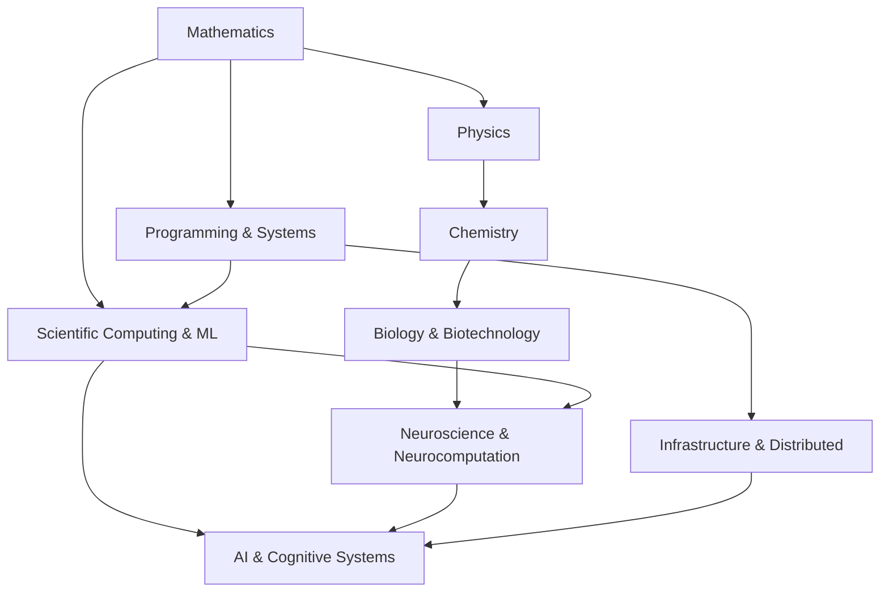
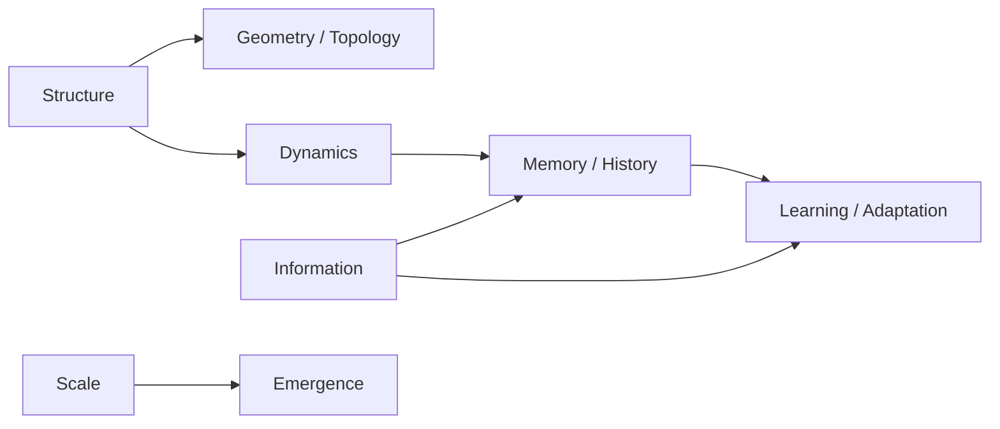

# Knowledge Graph

[← Maps](README.md)

```mermaid
graph TD
    B[Mathematics] --> A[Programming & Systems]
    B --> C[Scientific Computing & ML]
    B --> G[Physics]

    A --> C
    A --> E[Infrastructure & Distributed]

    G --> H[Chemistry]
    H --> I[Biology & Biotechnology]
    I --> D[Neuroscience & Neurocomputation]

    C --> D
    C --> F[AI & Cognitive Systems]
    D --> F
    E --> F
```

```mermaid
graph LR
    S[Structure] --> GT[Geometry / Topology]
    S --> DY[Dynamics]
    DY --> MH[Memory / History]
    MH --> LA[Learning / Adaptation]
    INFO[Information] --> MH
    INFO --> LA
    SCALE[Scale] --> EM[Emergence]
```

O grafo representa relações explicativas e caminhos de estudo úteis, não a redução completa de uma disciplina à outra.
